# Hotel Guest Assistant

A scoped hotel website chat assistant for guests who need fast answers about rooms, amenities, policies, and availability. The assistant keeps visible conversation context, returns auditable sources, and falls back safely when information is missing or a service fails. The product goal is simple: reduce repetitive front-desk questions while keeping booking-critical answers grounded and predictable.

Live demo: [Simplotel AI Concierge](https://simplotel-assistant.onrender.com/)

## Architecture

```text
Guest
  -> React + Vite frontend
  -> FastAPI backend
  -> Intent routing
  -> KB retrieval + server-side LLM rendering
       or deterministic availability function
  -> Structured response with intent and sources
```

The frontend never calls an LLM and contains no API keys. FastAPI owns intent routing, knowledge-base retrieval, deterministic availability checks, and the swappable LLM service module.

The frontend also publishes `frontend/public/llms.txt` so Lighthouse's experimental Agentic Browsing checks and AI agents have a concise machine-readable summary of the app's purpose, routes, and API surface.

## Project Structure

```text
hotel-guest-assistant/
├── frontend/
│   └── src/{components,pages,services,hooks,types}/, App.tsx
├── backend/
│   ├── app/{main.py, api/, services/, models/, tools/, data/, core/}
│   ├── tests/
│   ├── requirements.txt
│   └── .env.example
├── README.md
└── .gitignore
```

## Screenshots

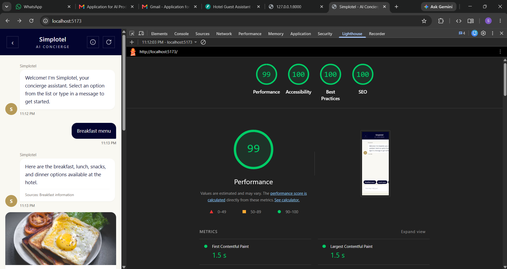
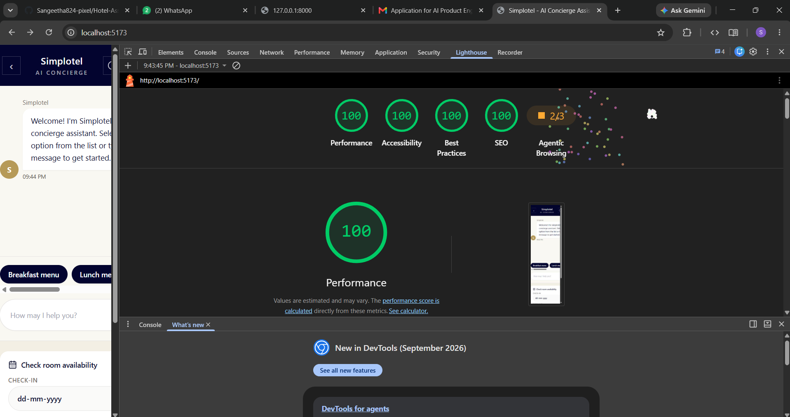
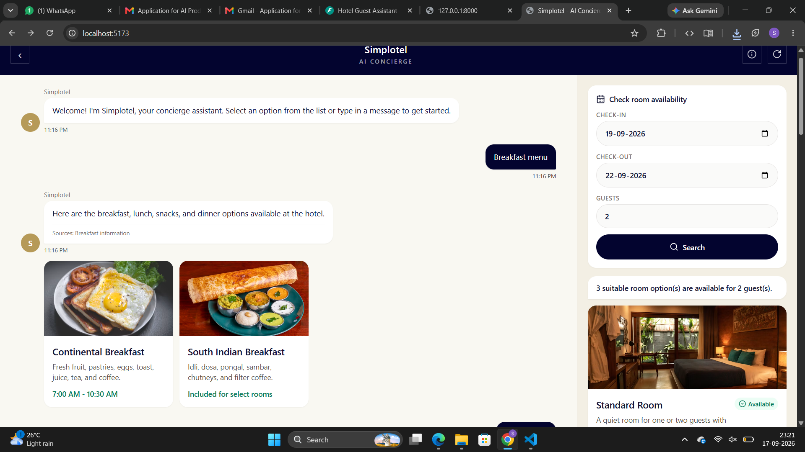
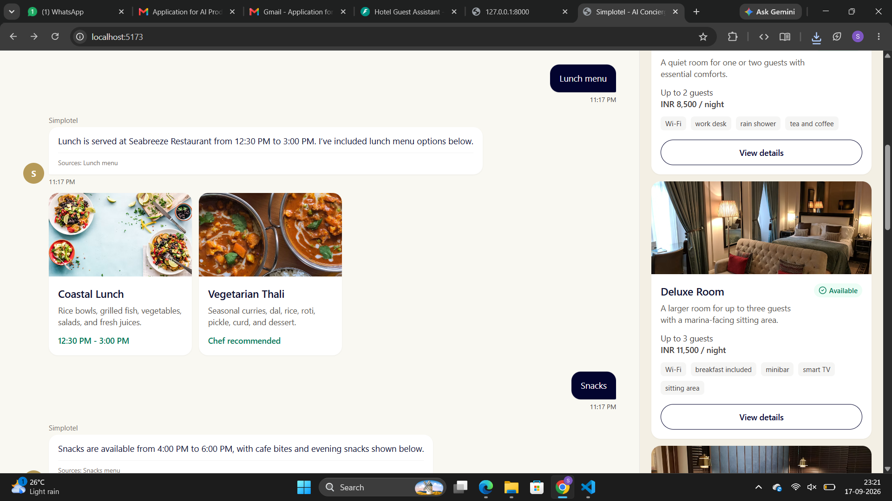
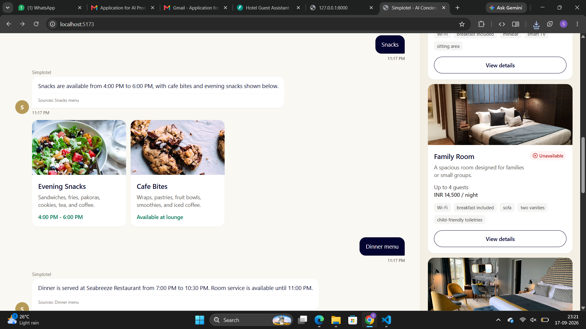
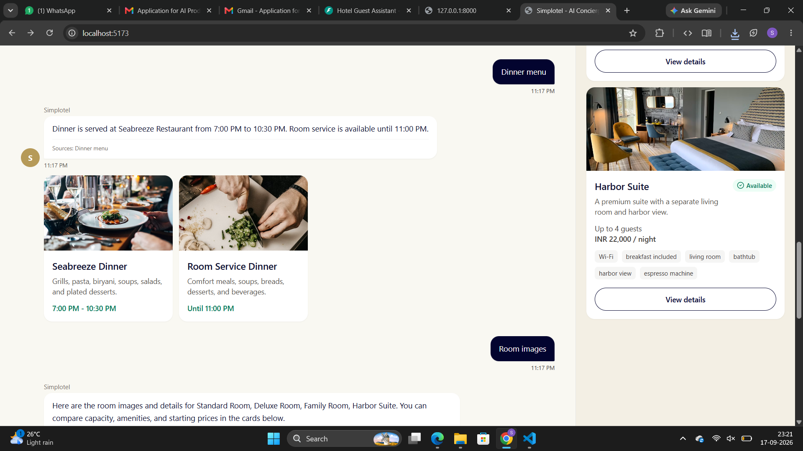
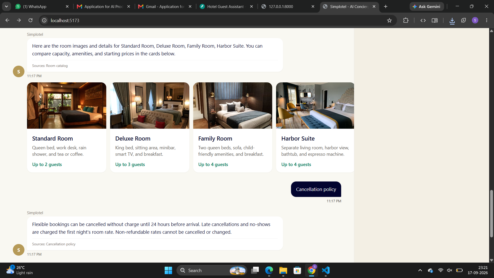
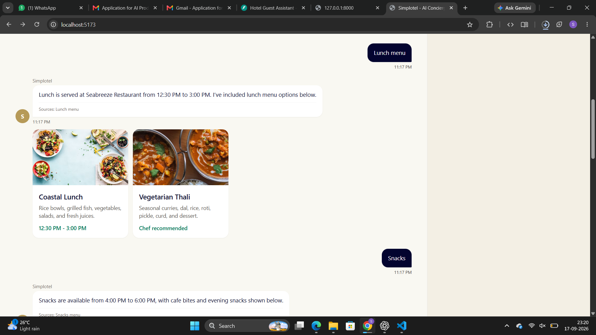
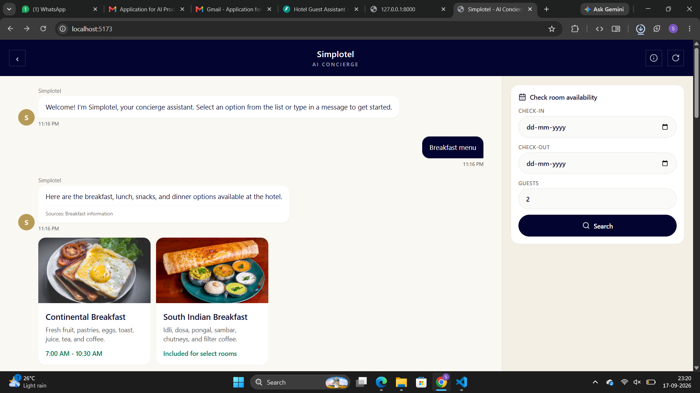
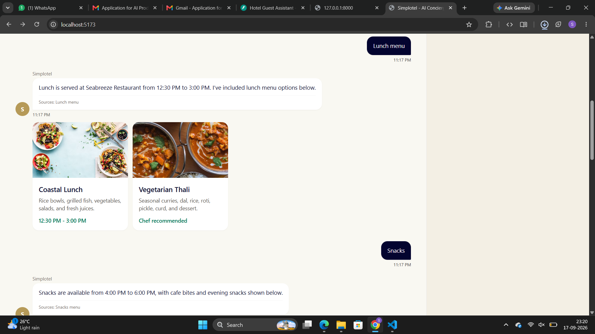
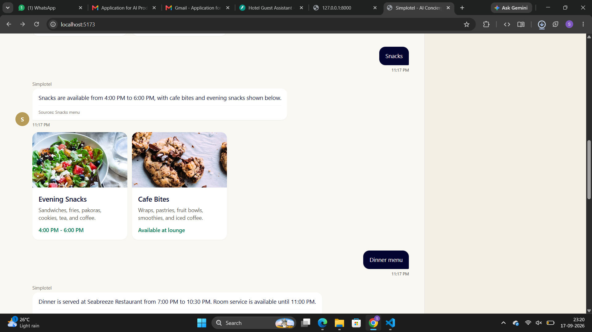
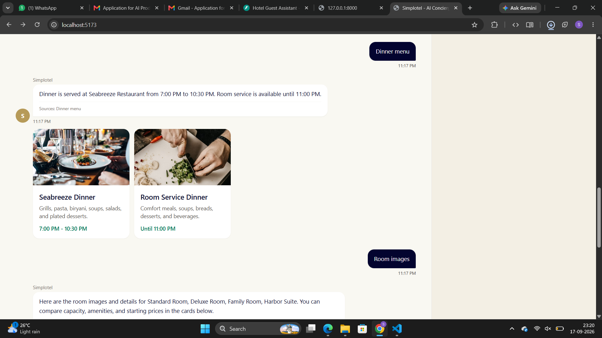
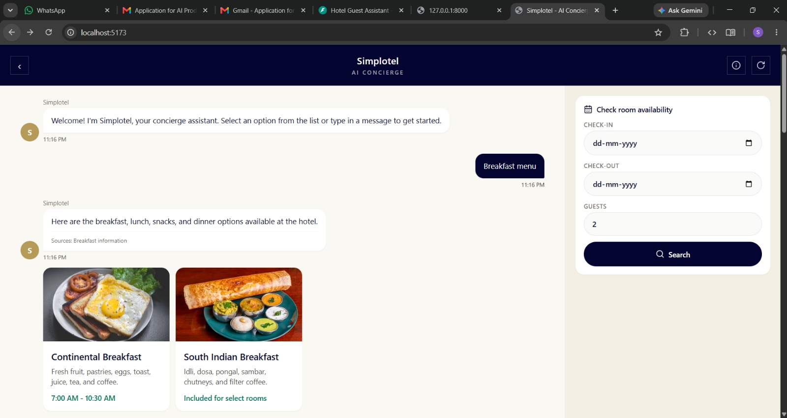
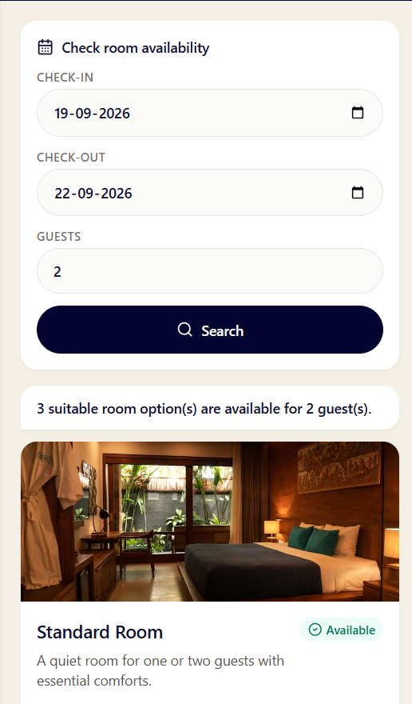
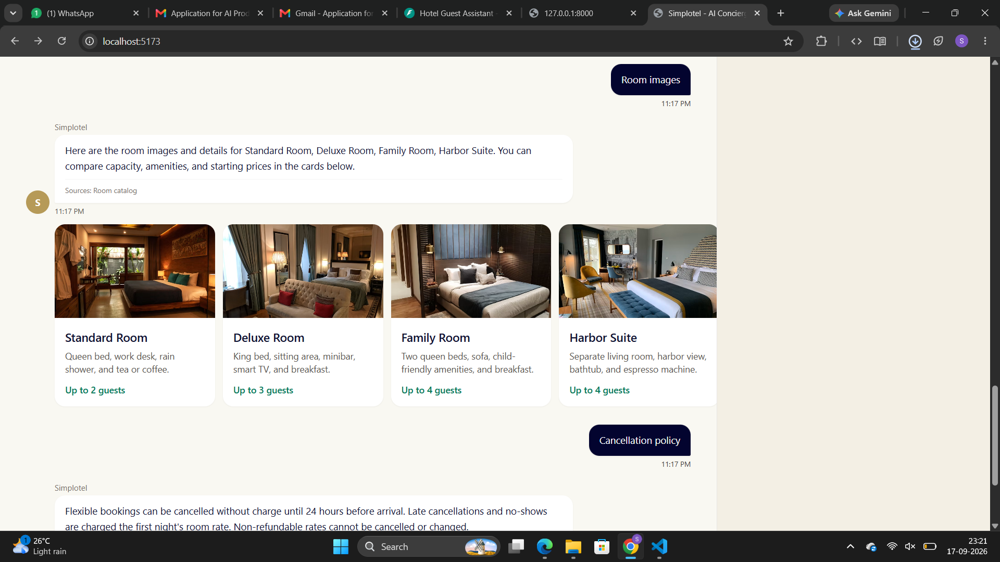
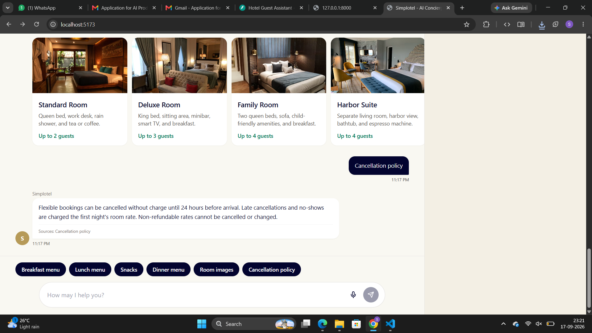
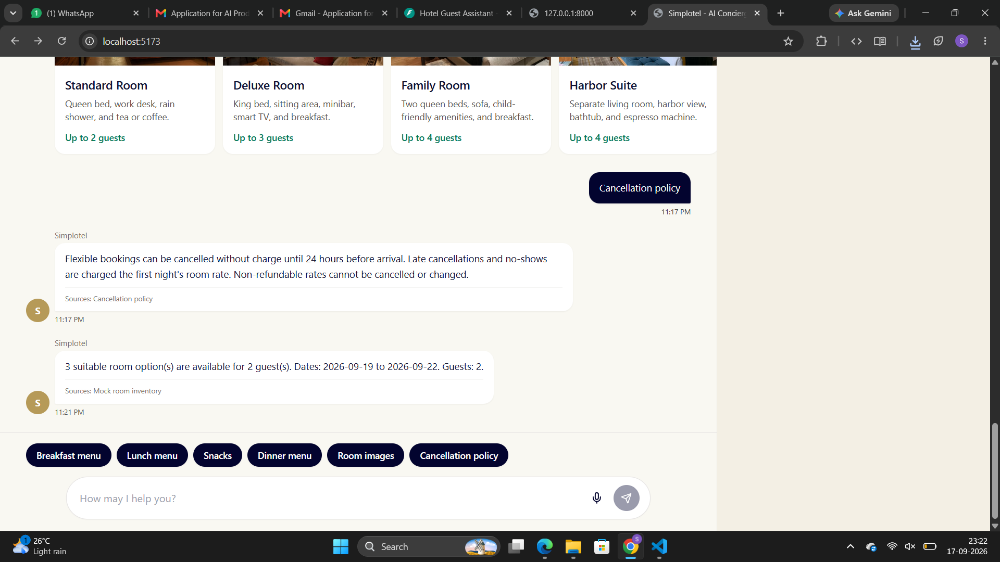


## Setup

Backend:

```bash
cd backend
python -m venv .venv
.venv\Scripts\activate
pip install -r requirements.txt
copy .env.example .env
uvicorn app.main:app --reload
```

Frontend:

```bash
cd frontend
npm install
npm run dev
```

Default URLs:

- Frontend: `http://localhost:5173`
- Backend: `http://localhost:8000`
- FastAPI docs: `http://localhost:8000/docs`

Environment variables:

- `APP_NAME`: FastAPI application name
- `CORS_ORIGINS`: allowed frontend origins
- `LLM_PROVIDER`: `mock` for local use, `fail` to simulate provider failure
- `LLM_API_KEY`: reserved for a real provider, not required for the mock
- `LLM_MODEL`: model/provider label

## Docker Deployment

The project includes a single-container Docker deployment. The Docker image builds the React/Vite frontend, copies the static files into the Python runtime image, and serves both the frontend and FastAPI API from one container.

Build locally:

```bash
docker build -t hotel-guest-assistant .
```

Run locally:

```bash
docker run --rm -p 8000:8000 -e LLM_PROVIDER=mock -e LLM_MODEL=mock-grounded-assistant hotel-guest-assistant
```

Open:

- App: `http://localhost:8000`
- Health: `http://localhost:8000/health`
- API docs: `http://localhost:8000/docs`
- Agent summary: `http://localhost:8000/llms.txt`

Cloud deployment with Docker:

1. Push this repository to GitHub.
2. Create a Docker/Web Service on Render, Railway, Fly.io, Google Cloud Run, or another container host.
3. Use the repository root as the build context.
4. Let the platform build from `Dockerfile`.
5. Set environment variables:

```text
LLM_PROVIDER=mock
LLM_MODEL=mock-grounded-assistant
```

Most cloud platforms provide `PORT` automatically. The container start command already reads `${PORT:-8000}`, so it works locally and in cloud.

For Docker production mode, the frontend calls same-origin `/api/...`, so no public API URL is needed in `VITE_API_BASE_URL`.

## API

Chat:

```bash
curl -X POST http://localhost:8000/api/chat ^
  -H "Content-Type: application/json" ^
  -d "{\"message\":\"What time is check-in?\",\"conversation\":[]}"
```

Response:

```json
{
  "answer": "Check-in starts at 3:00 PM...",
  "intent": "hotel_faq",
  "sources": [{ "id": "hotel.check_in", "title": "Check-in time" }]
}
```

Availability:

```bash
curl -X POST http://localhost:8000/api/availability ^
  -H "Content-Type: application/json" ^
  -d "{\"check_in\":\"2026-10-10\",\"check_out\":\"2026-10-12\",\"guests\":3}"
```

Response includes the search dates, guest count, a message, and room cards with name, type, max guests, price per night, availability, description, and features.

## Knowledge Base

The local JSON knowledge base in `backend/app/data/hotel_kb.json` is the only source of truth for hotel facts. Intent classification happens before any LLM call. The backend retrieves only the relevant section, passes only that snippet to the LLM service, and returns the source id/title with the answer.

Unsupported questions use this fixed fallback:

> I'm sorry, I don't have reliable information about that. I can help with hotel rooms, amenities, policies, and availability.

## Availability

Availability is deterministic, not LLM-decided. `check_availability()` validates dates and guests, filters rooms by capacity, joins against mock inventory, and returns structured results. The LLM may render structured results conversationally, but it does not decide whether rooms are available.

## Hallucination Prevention

The backend classifies intent first, retrieves a targeted KB section, and constrains AI answering to that snippet. Every chat response includes `intent` and `sources` so the UI and logs can audit where an answer came from.

## Error Handling

The frontend shows friendly retryable errors for backend outages, timeouts, invalid inputs, empty messages, and service failures. The backend uses Pydantic validation, catches known KB/inventory/LLM failures, logs server-side details, and returns clean HTTP errors without stack traces or secrets.

## Testing

Run backend tests:

```bash
cd backend
pytest
```

Actual latest run:

```text
============================= test session starts =============================
platform win32 -- Python 3.12.14, pytest-8.3.4, pluggy-1.6.0
rootdir: C:\Users\ELCOT\OneDrive\Documents\ChatGPT\Hotel Assistant\backend
plugins: anyio-4.15.1, asyncio-0.25.2
collected 17 items

tests\test_api.py ..............                                         [ 82%]
tests\test_availability.py ...                                           [100%]

======================== 17 passed, 1 warning in 2.71s ========================
```

Covered cases include check-in, pool, breakfast, room suitability, cancellation policy, availability happy path, missing availability info, invalid date ranges, unsupported fallback, follow-up context, LLM failure fallback, and a chat-to-availability integration path.

## UX Decisions

Suggested question chips make the first interaction easier and cover common hotel queries. Availability uses a form because dates and guest count require precise validation; this avoids letting free-text ambiguity decide booking-critical behavior. Room cards expose capacity, price, status, and features in a scan-friendly way across desktop, tablet, and mobile.

## Known Limitations

- The LLM provider is a mock local renderer by default.
- Availability uses static mock inventory, not date-by-date real inventory.
- Natural-language date extraction is intentionally limited; the reliable path is the availability form.
- No authentication, payments, booking hold, or PMS integration.
- Conversation persistence is browser-local only, not account-based or shared across devices.

## Production Improvements

Not implemented:

- Real PMS integration
- Real-time inventory and rate rules
- Authentication and guest account linking
- Database-backed content and conversations
- Observability, tracing, and alerting
- Rate limiting and abuse protection
- Response caching
- Better retrieval/RAG ranking
- Evaluation pipeline for grounded answers
- Prompt versioning
- Human handoff
- Internationalization
